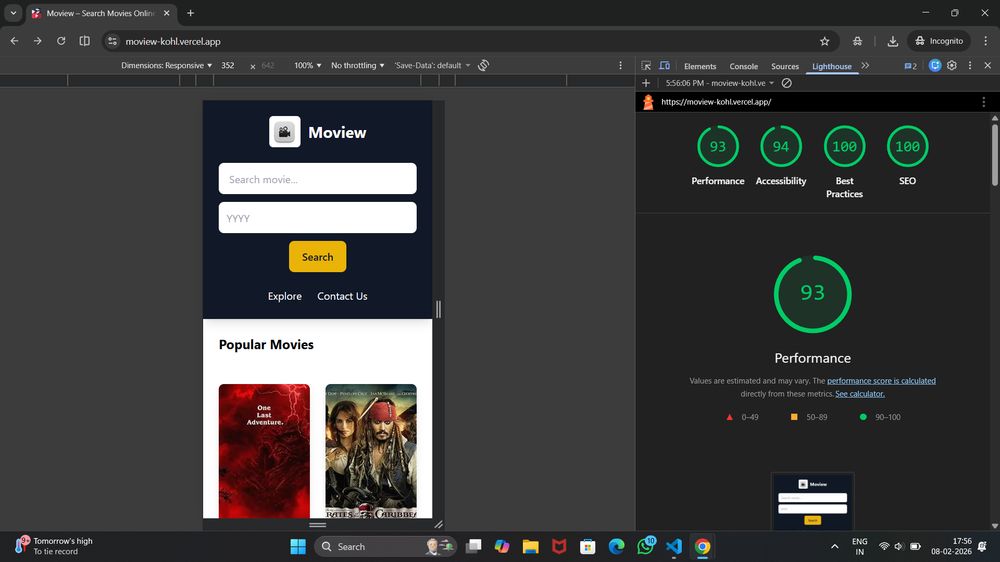
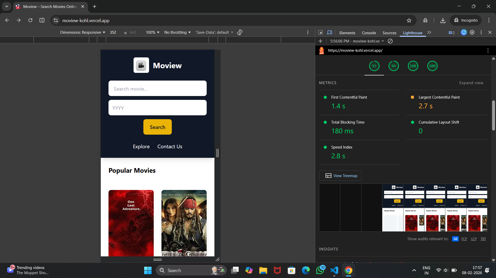

# 🎬 Moview — SEO Optimized Movie Search App

A fast, SEO‑optimized movie discovery web app built with **Next.js** and the **OMDb API**. Users can search movies by title and year, explore details, and view rich metadata optimized for search engines.

---

## 🚀 Live Demo

👉 **[View Deployed App](https://moview-kohl.vercel.app)**

---

## ✨ Features

* 🔍 Movie search by title & year
* 🎥 Detailed movie pages with ratings and metadata
* ⚡ Server‑side rendering (SSR) for SEO
* 🖼️ Optimized images using Next.js Image
* 🧠 Structured data (JSON‑LD schema)
* 🗺️ Auto‑generated sitemap & robots.txt
* 📱 Fully responsive UI
* 🚀 Deployed on Vercel

---

## 🛠️ Tech Stack

* **Framework:** Next.js
* **Styling:** Tailwind CSS
* **API:** OMDb API
* **Deployment:** Vercel
* **SEO:** Lighthouse optimization + structured metadata

---

## 📊 SEO Performance

This project is optimized following Google Lighthouse best practices.

### Lighthouse Report




---

## ⚙️ Installation & Setup

### 1. Clone the repository

```
git clone https://github.com/aakashverse/moview.git
cd moview
```

### 2. Install dependencies

```
npm install
```

### 3. Add environment variables

Create a `.env.local` file:

```
OMDB_API_KEY=your_api_key_here
```

### 4. Run development server

```
npm run dev
```

Open:

```
http://localhost:3000
```
